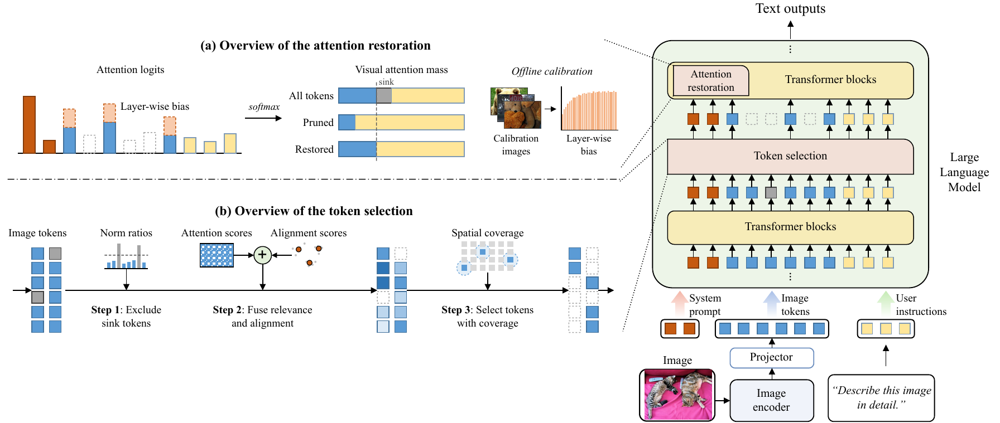

# FaithPrune: Hallucination-Aware Visual Token Pruning for Efficient and Faithful Multimodal Large Language Models

Official PyTorch implementation of the paper "FaithPrune: Hallucination-Aware Visual Token Pruning for Efficient and Faithful Multimodal Large Language Models", submitted to IEEE Transactions on Multimedia.

<p align="center">
  
</p>

## Introduction

FaithPrune is a training-free visual token pruning framework for MLLMs. It consists of two components: Sink-Robust Relevance and Alignment Scoring (SR²S) for token selection, and Visual Attention Mass Restoration (VAMR) for restoring the visual attention of the pruned model. FaithPrune is evaluated on LLaVA-1.5, LLaVA-NeXT, and Qwen2.5-VL.

## Installation

```bash
git clone https://github.com/goodekang/FaithPrune.git
cd FaithPrune
conda create -n faithprune python=3.10 -y
conda activate faithprune
pip install -r requirements.txt
pip install -e .
python -m spacy download en_core_web_lg
```

## Data Preparation

Download COCO, POPE, CHAIR, AMBER, HallusionBench, and GQA, and put them under `data/`. The directory layout is given in `scripts/sh/00_prepare.sh` and `configs/eval/`. The general benchmarks are loaded by [lmms-eval](https://github.com/EvolvingLMMs-Lab/lmms-eval).

## Usage

Prepare the data splits and the centroids, and calibrate the attention bias for a token budget K.

```bash
bash scripts/sh/00_prepare.sh
python scripts/calibrate.py --config configs/default.yaml configs/models/llava15_7b.yaml --set method.budget=64
```

Evaluate on POPE and CHAIR.

```bash
python scripts/run_pope.py --config configs/default.yaml configs/models/llava15_7b.yaml configs/eval/pope_b.yaml --set method.budget=64
python scripts/run_chair.py --config configs/default.yaml configs/models/llava15_7b.yaml configs/eval/chair.yaml --set method.budget=64
```

All experiments in the paper can be reproduced with the scripts in `scripts/sh/`.

## Citation

```bibtex
@article{guo2026faithprune,
  title   = {FaithPrune: Hallucination-Aware Visual Token Pruning for Efficient and Faithful Multimodal Large Language Models},
  author  = {Guo, Dekang and Feng, Xingyu},
  journal = {IEEE Transactions on Multimedia},
  year    = {2026}
}
```

## Acknowledgements

This project is built on [LLaVA](https://github.com/haotian-liu/LLaVA), [Transformers](https://github.com/huggingface/transformers), and [lmms-eval](https://github.com/EvolvingLMMs-Lab/lmms-eval). We thank the authors for their code.
